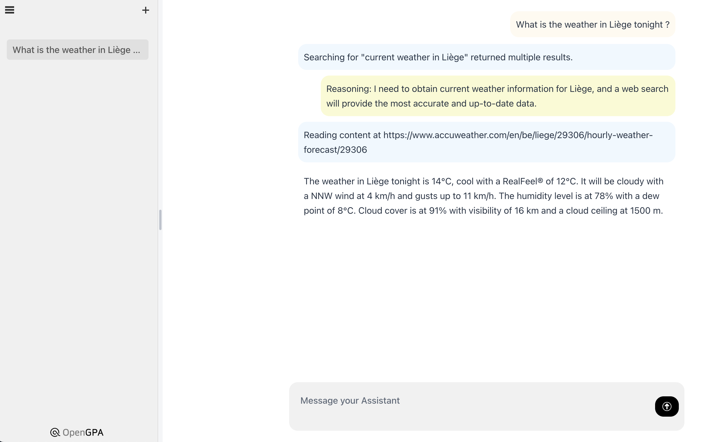

# OpenGPA: Open General Purpose Assistant

[](https://twitter.com/eschnou) &ensp;
[](https://opensource.org/licenses/MIT)

**OpenGPA** is an Open-source, extensible. General Purpose Assistant. A self-hosted solution boasting capabilities similar to
popular GPTs.

- Free and open source, deploy anywhere, customize to your needs
- Support for [all major LLMs](https://docs.spring.io/spring-ai/reference/api/chatmodel.html) such as LLama, Mistral, Anthropic, OpenAI, etc.
- Off-line first. You can run on your own box with a local LLM. Data won't leave the server. All the power of GPT without the data privacy nightmare.
- Extensible framework allows to plug your own actions, such as calling into internal services and APIs
- Supports the [Agent Protocol](https://github.com/AI-Engineer-Foundation/agent-protocol) for easy integration in a nascent ecosystem
- Simple UI exposing insight on the GPA internal reasoning and actions



## :pencil2: Design principles

OpenGPA is much more than a UI on top of a LLM. It implements an Agentic workflow, with one or more LLMs are used as the *brain* of an agent 
to reason and invoke actions, and augmented with components like Reflection, Memory, Data Augmentation (RAG), etc.

In particular, OpenGpa is using the [ReAct](https://arxiv.org/abs/2210.03629) approach to verbally reason on the next step, decide on the
action to execute, and observe the outcome.

```
{
  "reasoning": "The user wants to know the current weather in Liege, Belgium. 
                The best action to get this information is to perform a web search with 
                the query 'current weather in Liege, Belgium'. The result of this action 
                will then be used to respond to the user's request. 
                This is not the final action as we have to get the results from the web 
                search first."
  "action": {
    "name": "webSearch",
    "arguments": {
      "query": "current weather in Liege, Belgium"
    }
  },
  "is_final": false
}
```

Action selection is based on a catalog of action that can easily be extended through code. You could add an action
to tap into an internal service to fetch some data, or a workflow engine to trigger a next step, etc.

## 🛠️️ Key Features

The current version is a minimal POC yet, it already packs a few interesting pieces:
- Works with all LLM supported by [spring-ai](https://spring.io/projects/spring-ai), including running **LLama** locally
- Multi-step task processing with **chain-of-thought** approach
- Action model with easy to extend **actions** for use by the agent
- Upload of **artifacts** to process by the agent
- Download of **artifacts** generated by the agent

## 🚧 Roadmap

Improve the Agentic capabilities:
- Add support for **RAG** enabling the agent to consult vast volume of internal documents
- Add support for **Memory** enabling the agent to remember key facts and use them later
- Add support for **code generation** and **execution** within the agent (using Groovy scripts?)
- Add support for **remote API invocation** to tap into existing enterprise APIs
- Improve **web browsing** and **web interactions** (e.g. allowing the agent to submit forms)

Make 0XEE enterprise ready:
- Persistence of tasks/steps
- Proper file storage and management
- User management and access control
- Secure API access through API gateway
- Auditing of task processing costs (token usage)
- Instrumentation and observability

## 📊 Benchmark

opengpa is currently passing 16 of the AutoGPT benchmark tests. You can 
view the results [here](documentation/benchmark.md)

## 🚀 Getting started

### Build and run the server

By default, opengpa is using a locally hosted LLama3 as its core LLM. Check the `application.properties` file 
for configuration options and the spring-ai documentation to configure support for other LLMs.

```bash
mvn clean package -Pproduction
OPENAI_API_KEY=sk-*** java -jar target/opengpa-service-0.0.1-SNAPSHOT.jar
```

Open the UI on [http://localhost:8000](http://localhost:8000)

### Run the benchmark

Check the [AutoGPT](https://agpt.co) repo [benchmark](https://github.com/Significant-Gravitas/AutoGPT/tree/master/benchmark) folder to configure the `agbenchmark` command line. Once installed
and configured, it should be as easy as triggering any test you want:

```bash
agbenchmark run --test ReadFile
```

# License

opengpa - Open and extensible general purpose assistant
Copyright (C) 2024  Laurent Eschenauer

This program is free software: you can redistribute it and/or modify
it under the terms of the GNU General Public License as published by
the Free Software Foundation, either version 3 of the License, or
(at your option) any later version.

This program is distributed in the hope that it will be useful,
but WITHOUT ANY WARRANTY; without even the implied warranty of
MERCHANTABILITY or FITNESS FOR A PARTICULAR PURPOSE.  See the
GNU General Public License for more details.
